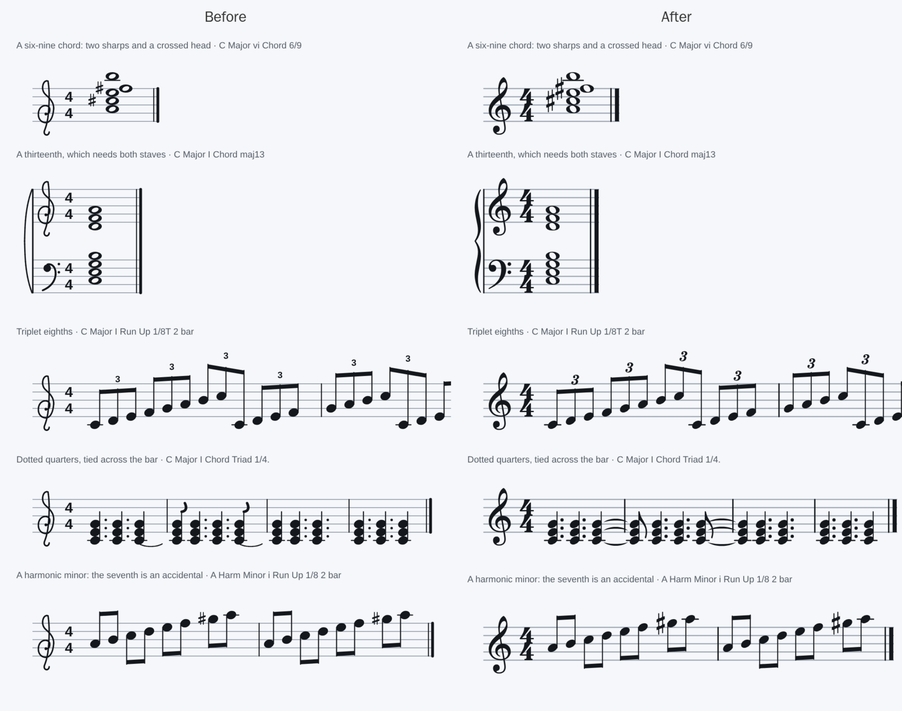

# 2026-10-08 - Bravura's ink, without a font

The ask: make the notation look as good as Noterator's, without breaking
anything. Noterator sets every symbol in Bravura; this app drew its own from
lines and circles (0004). Side by side, the difference was the clef, the
noteheads, the time signature's sans-serif figures, and lines weighted by eye.

## What was done

- **Bravura's outlines baked into the script** (0013).
  `tools/bake_glyphs.py` reads Bravura.otf, flattens 52 symbols into
  polygons in staff spaces and writes `reascripts/sb_glyphs.lua`. Nothing is
  loaded at run time, so 0004's objection - a user without the font sees tofu -
  does not arise.
- **The pen's `poly` went from convex to simple-and-clockwise**, and the
  window's pen to `DrawList_AddConcavePolyFilled`. That function is tagged
  `0_9` in ReaImGui's own source (`api/drawlist.cpp`), the API version the
  script already loads, so no one's ReaImGui gets less capable.
- **Lines to Bravura's engraving defaults**: stem 0.12, staff 0.13, ledger
  0.16 reaching 0.4 past the head, beam 0.5 with 0.25 between, thin and thick
  final bar 0.16 and 0.5 with 0.4 between. Beams now reach the stems' outer
  edges; before, half of each end stem stuck out past its beam.
- **Ties are crescents, every note of a tied chord is tied, and a tie crosses
  the bar line** to the chord it holds into. Before, a tied triad drew one tie
  under its lowest note that stopped at the bar line.
- **A dotted rest shows its dot.** It never did; nothing had asked.
- **Dots line up after the rightmost head**, so a head crossed to the right
  of the stem no longer sits on its neighbours' dots.
- **A flag gets room** (`N.FLAG_GAP`). Bravura's eighth flag is a real flag,
  over a space wide, and at the old 2.2 spacing it reached over the next
  chord's heads in "dotted quarters tied across the bar". The old hook had the
  same fault, only smaller.
- Layout widths follow the new glyphs: `HEAD_RX` 0.59, `WHOLE_RX` 0.844, the
  accidental widths, `ACC_CLEAR` 7 (Bravura's sharp is 2.8 spaces tall, so a
  sixth apart let a sharp touch a flat below it), `CLEF_WIDTH` 4.0,
  `SIG_STEP` 1.05, and `N.timeWidth` so twelve-eight has room for two figures.

## The route

- **Holes were the real problem.** ReaImGui fills a simple polygon, concave or
  not, but nothing with a hole, and most of these symbols have one - the flat's
  bowl, the sharp's middle, the clef's loops, the 0, 6, 8 and 9. Splitting a
  glyph along a cut through each hole works, but cut flush, the two pieces'
  anti-aliased edges each cover about half a pixel, and together they leave a
  hairline. The bake cuts with **overlap** instead: each piece runs a tenth of
  a space past the cut, so each one's solid interior covers the other's soft
  edge. Shapely does the cutting; the tool tries a vertical cut through the
  hole's middle, then a horizontal one, and refuses to go on if neither opens
  the hole.
- **Winding matters to ReaImGui and to nothing else here.** Dear ImGui's
  anti-aliased fill computes each edge's normal as `(dy, -dx)` and pushes the
  fringe that way, which is outward only for a clockwise shape on screen
  (read in `imgui_draw.cpp`, `AddConcavePolyFilled`). The SVG preview fills
  either winding identically, so a backwards shape is invisible in every tool
  this repository has - which is exactly why it is now asserted. Turning
  `fill()`'s correction off fails the test on the kit's page, whose beams are
  built anticlockwise: a beam's four corners are listed the same way whichever
  way its stems turn, so beams under one stem direction have been wound
  backwards since the start - their edges anti-aliased inward, a shade thin.
  (This log first blamed the final bar line; checking which shapes the
  correction actually turned showed it was only ever the beams.)
- **The open noteheads kept their punch.** Bravura's half note has a real
  counter, and the obvious move was to let the staff show through it. This app
  decided otherwise (the counter is opaque, the line stops at the head's edge)
  and tests it, so the bake keeps those two heads' outside and counter apart
  and the page punches the counter with the paper as before.
- **Two drawing tests went on passing for the wrong reason.** The notehead
  check took "the first wide, tall filled shape" as the head, and the first
  one is now the clef; that one failed honestly. The flag check counted "any
  line right of the stem near its tip" and *still passed with no flags drawn* -
  it was finding the next note's ledger line. Both now look inside the bar,
  the flag check looks for a filled shape that starts at the stem and hangs
  along it, and both were shown to fail with the thing they cover removed.
- **The clef margin was written and taken out again.** Bravura's G clef rises
  1.4 spaces over the top line, and `D.margins` was given room for it - which
  no test could fail without, because the page's 1.2-space pad already covered
  it. A block whose notes stay inside the staff was added to the
  "nothing outside the reserved room" sweep instead, so the clef is what it
  checks; doubling the clef's size fails it.

## Checked

- Every suite passes, and each new or changed assertion was broken on purpose
  and seen to fail: no flags, flags on the wrong side, no punch, the whole rest
  on the wrong line, an oversized clef, ties stopping at the bar, one tie per
  chord, and polygons left anticlockwise.
- Rendered with `tools/preview_page.lua`, light and dark, and looked at.

## Not done

- The window itself was not run - there is no REAPER here. The pen change is
  one call, and the UI test's mock now has `DrawList_AddConcavePolyFilled`
  (and no longer the convex one), so a typo would fail there; but how the
  anti-aliasing looks at ten pixels to the space has only been reasoned about,
  not seen.
- A tie that runs off the end of a system still stops at the edge; the next
  system does not pick it up with a half tie.
- Ledger lines are as wide as the head's own column, not stretched under a
  head crossed to the other side of the stem.
